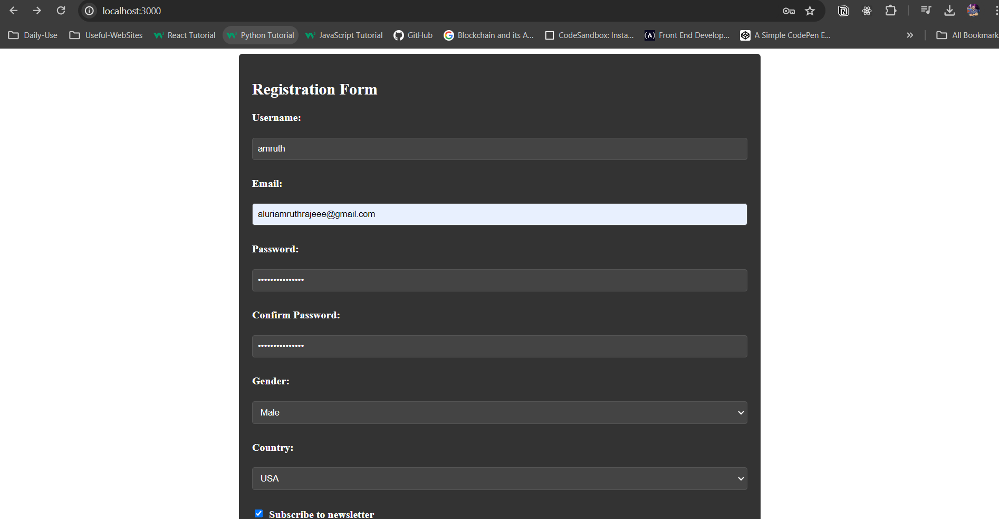
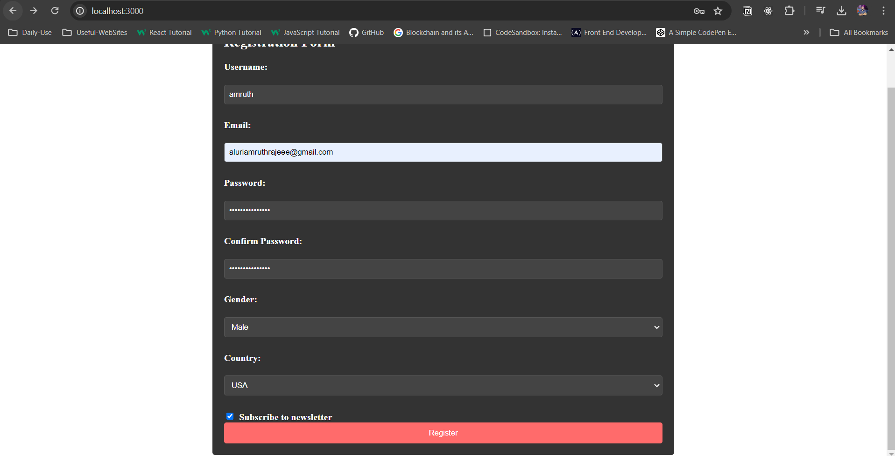
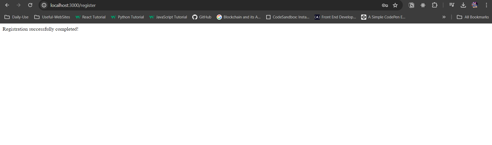

# Registration Form and Response Project

This project implements a simple registration form using Node.js with Express. Users can fill out the form with their username, email, password, and other details, and upon submission, the server responds with a confirmation message.

## Demo

## Features

- Allows users to fill out a registration form.
- Validates input fields (e.g., required fields, email format).
- Responds with a confirmation message upon form submission.
- ...

## Getting Started

These instructions will help you get a copy of the project up and running on your local machine for development and testing purposes.

### Prerequisites

- Node.js installed on your machine.
